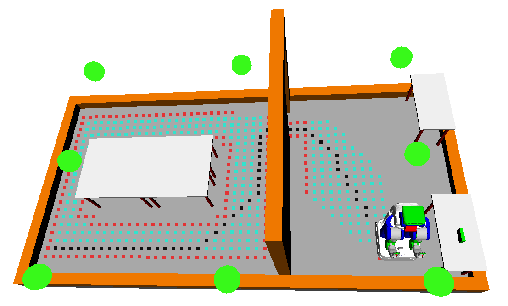

# Sampling-Based Gaussian Estimation of Probability of Collision for Safe Planning

    
This repository contains an implementation of a novel method I created in April 2018 to estimate the probability of collision for a given motion plan for a robot. More information about the method can be found in this [paper](https://ajaayc.github.io/resources/ajaay_paper.pdf) I wrote.

For this research, I utilized the [OpenRave](http://openrave.org/) simulation framework and the [Armadillo](http://arma.sourceforge.net/) linear algebra library. I created an OpenRave C++ plugin that executes the method that I described in the paper. The method in the paper is tested on a motion plan generated using the A* planning algorithm in the R^2 X S^1 topological space on the Willow Garage [PR2 robot](http://www.willowgarage.com/pages/pr2/overview). In February 2019, I attempted to reimplement the method using a motion plan generated from the RRT-Connect algorithm; this implementation is still a work in progress.
    
At some point, I plan to update the documentation for this repo so that the results from the paper can be reproduced. In the mean time, apologies for the lack of organization. If you have any questions about my work in the mean time, feel free to write up an issue.

I give my thanks to the following individuals for the suggestions they gave me throughout the course of this project:
* Dmitry Berenson
* Maani Ghaffari
* Valerie Chen