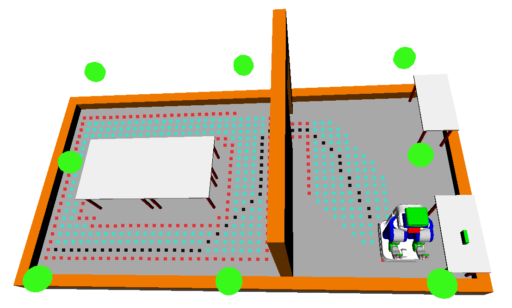

# Sampling-Based Gaussian Estimation of Probability of Collision for Safe Planning


    
This repository contains an implementation of a novel method I created in April 2018 to estimate the probability of collision for a given motion plan for a robot. More information about the method can be found in this [paper](https://ajaayc.github.io/resources/ajaay_paper.pdf) I wrote.

For this research, I utilized the [OpenRave](http://openrave.org/) simulation framework and the [Armadillo](http://arma.sourceforge.net/) linear algebra library. I created an OpenRave C++ plugin that executes the method that I described in the paper. The method in the paper is tested on a motion plan generated using the A* planning algorithm in the R^2 X S^1 topological space on the Willow Garage [PR2 robot](http://www.willowgarage.com/pages/pr2/overview). In February 2019, I attempted to reimplement the method using a motion plan generated from the RRT-Connect algorithm; this implementation is still a work in progress.

## Prerequisites

Before running the simulator and probability of collision computation, ensure you have the following dependencies installed:

### Required Software
- **Python 2.7** (required for OpenRAVE compatibility - *Note: Python 2.7 reached end of life in January 2020, but is required for OpenRAVE compatibility*)
- **OpenRAVE 0.9+** - Robotics simulation framework ([installation guide](http://openrave.org/docs/latest_stable/install/))
- **Armadillo 8.4+** - C++ linear algebra library ([download](http://arma.sourceforge.net/))
- **CMake 2.6+** - For building the C++ plugin
- **Boost** (version matching OpenRAVE requirements)

### Python Dependencies
- `numpy` - Numerical computing
- `openravepy` - Python bindings for OpenRAVE
- `pickle` (also available as `cPickle` for better performance) - Object serialization (included in Python 2.7 standard library)

Install Python dependencies:
```bash
pip install numpy
```

Note: `openravepy` is installed as part of the OpenRAVE installation.

## Building the Project

### Step 1: Build the OpenRAVE C++ Plugin

The `mcsimplugin` folder contains a custom OpenRAVE C++ plugin that is required for the simulation to function. Build it using CMake:

```bash
cd mcsimplugin
mkdir -p build
cd build
cmake ..
make
cd ../..
```

This will compile the plugin and create `libmcsimplugin.so` (or `.dylib` on macOS) in the `mcsimplugin/build` directory.

## Running the Simulator

The simulation process consists of two main steps:

### Step 1: Generate Trajectory and Odometry Data

First, you need to generate a motion plan using the A* path planning algorithm. This creates the trajectory and odometry files required for the simulation:

```bash
python hw2_astar.py
```

**What this does:**
- Loads the PR2 robot in the OpenRAVE environment (using `data/pr2test2.env.xml`)
- Plans a collision-free path using A* algorithm from the robot's starting position to a goal configuration
- Generates two output files:
  - `trajectory.dat` - Contains the planned robot trajectory (sequence of [x, y, theta] configurations)
  - `odometry.dat` - Contains the odometry commands needed to follow the trajectory

**Note:** The OpenRAVE viewer window will open showing the robot and environment. Once the path is planned and the robot executes the trajectory, press Enter in the terminal to close the program and save the data files.

### Step 2: Run the Probability of Collision Computation

Once you have the trajectory and odometry data files, you can run the simulation with one of two methods:

#### Option A: Monte Carlo Simulation (MC)

To compute the probability of collision using Monte Carlo simulations:

```bash
python MCSimulation.py MC
```

**What this does:**
- Loads the generated `trajectory.dat` and `odometry.dat` files
- Runs multiple Monte Carlo simulations (default: 200, configurable via the `numSimulations` variable in the code)
- Each simulation samples from the uncertainty distribution to generate possible robot trajectories
- Computes the proportion of simulations that result in collisions
- Outputs results to a timestamped file `simReport_YYYY-MM-DD_HH_MM_SS.txt`

#### Option B: Sampling-Based GMM Collision Estimation (GMM)

To compute the probability of collision using the custom Gaussian Mixture Model estimation method:

```bash
python MCSimulation.py GMM
```

**What this does:**
- Loads the generated `trajectory.dat` and `odometry.dat` files
- Uses the novel "Sampling-Based GMM Collision Estimation" method described in the [paper](https://ajaayc.github.io/resources/ajaay_paper.pdf)
- Runs multiple estimations (default: 200, configurable via the `numSimulations` variable in the code)
- Fits Gaussian mixture models to the state uncertainty and samples to estimate collision probability
- Outputs results to a timestamped file `GMMsimReport_YYYY-MM-DD_HH_MM_SS.txt`

**Key Differences:**
- **MC method**: Standard Monte Carlo approach - simpler but requires more samples for accuracy
- **GMM method**: Novel efficient method using Gaussian mixture models - fewer samples needed for similar accuracy

### Understanding the Output

Both methods will:
1. Open an OpenRAVE viewer window showing the robot and environment
2. Display progress information in the terminal including:
   - Collision proportions for each simulation run
   - Time taken for each simulation
3. Generate a detailed report file containing:
   - Environment configuration
   - Motion and sensor noise parameters
   - All simulation times and collision probabilities
   - Average simulation time and average probability of collision
   - The complete trajectory and odometry data used

Additionally, checkpoint files (`checkpoint_*.txt` or `GMMcheckpoint_*.txt`) are created during the run to preserve results if the simulation is interrupted.

## Troubleshooting

### Common Issues

1. **"No module named openravepy"**
   - Ensure OpenRAVE is properly installed and the Python bindings are in your PYTHONPATH
   - Try: `export PYTHONPATH=$PYTHONPATH:/usr/local/lib/python2.7/dist-packages`

2. **"No module named astar_planner"**
   - The `astar_planner` module should be in the same directory as `hw2_astar.py`
   - Make sure you're running the script from the repository root directory

3. **"RaveLoadPlugin failed"**
   - Ensure the mcsimplugin was built successfully (check `mcsimplugin/build/` directory)
   - The plugin must be built before running `MCSimulation.py`

4. **"trajectory.dat or odometry.dat not found"**
   - You must run `hw2_astar.py` first to generate these files
   - The files should be in the repository root directory

## Customization

You can modify various parameters in the code:

- **Number of simulations**: Edit the `numSimulations` variable in `MCSimulation.py`
- **Number of particles**: Edit the `numParticles` variable in `MCSimulation.py`
- **Number of Gaussians (GMM)**: Edit the `numGaussians` variable in `MCSimulation.py`
- **Path planning parameters**: Edit distance/angle weights and discretization variables (e.g., `distanceWeight`, `angleWeight`, `distanceDisc`, `angleDisc`) in `hw2_astar.py`
- **Environment**: Change the `envindex` variable in `hw2_astar.py` to use different environments

## Additional Information

The mcsimplugin folder contains the custom OpenRAVE C++ plugin, which implements the core collision checking and state propagation functionality required for both the MC and GMM methods.

If you have any questions about this work or encounter issues not covered here, feel free to open an issue on GitHub.

I give my thanks to the following individuals for the suggestions they gave me throughout the course of this project:
* Dmitry Berenson
* Maani Ghaffari
* Valerie Chen